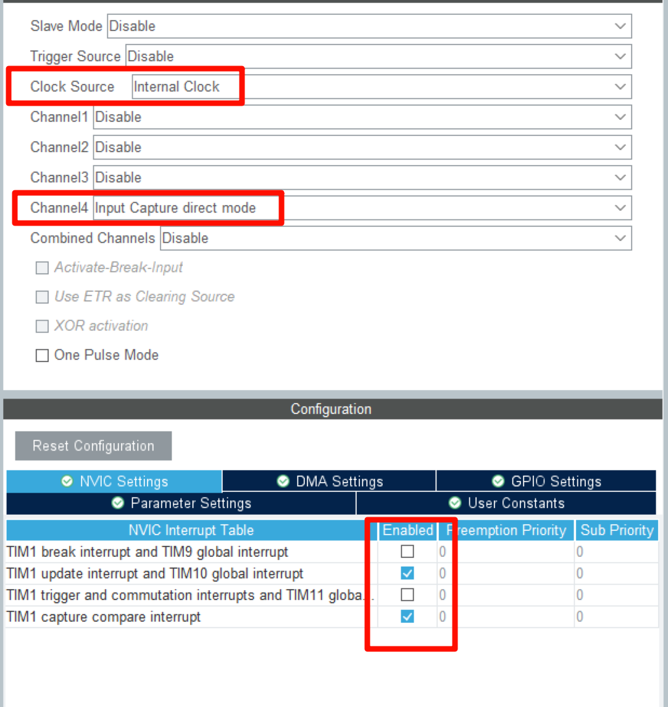
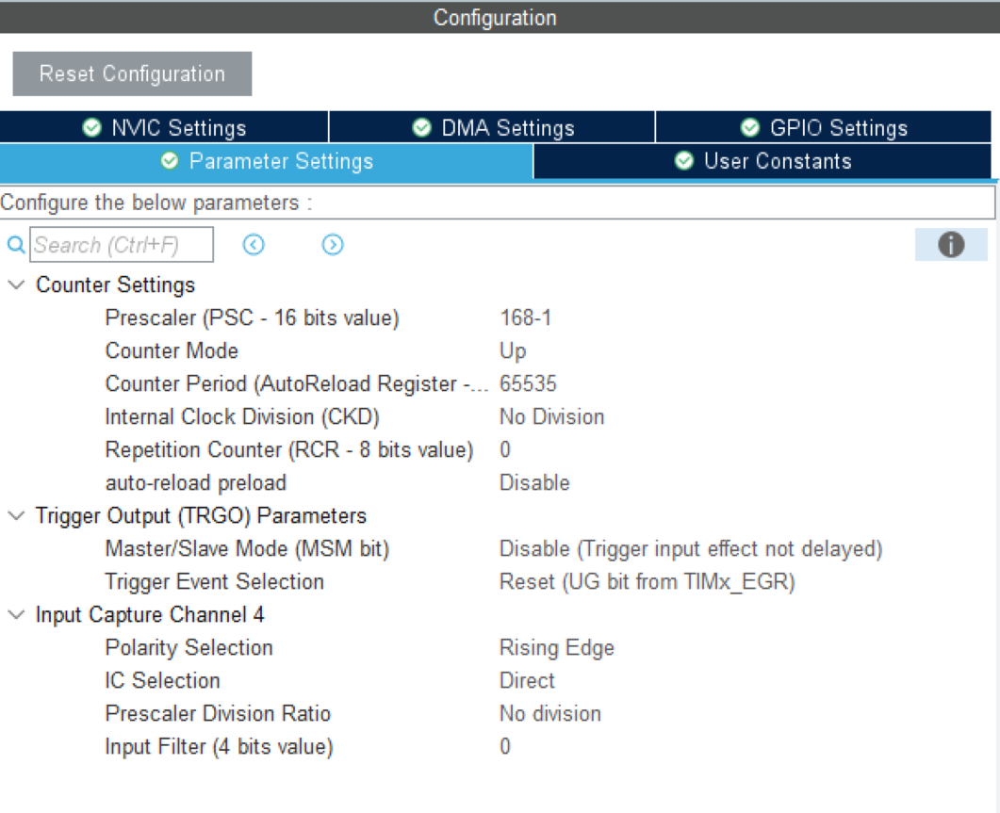

# stm32-红外遥控驱动

## 效果

获取红外发射器的键码值

## 配置

### 硬件

stm32f407ve

红外发射器与接收器如下

### 库

hal库

### cubemx配置:（可选）

时钟配置为168MHz

## 快速使用

`#include "InfraredRomote.h"`

### 头文件需要更改

无

### 初始化

`InfraredRemote_Init();`
### 使用
`key = InfraredRemote_Get_KeyNum();`

key即为接收的键码值

## 注意

接收的即为键码值，不是遥控器的值